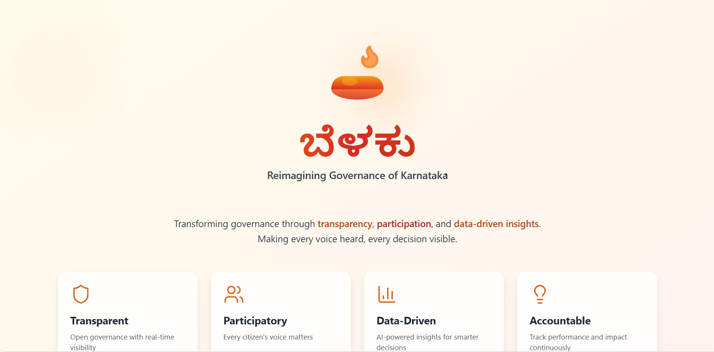

# ಬೆಳಕು 

> Reimagining Governance of Karnataka

## 🪔 About Belaku

Belaku reimagines the governance of Karnataka by transforming it into a **transparent, participatory, and data-driven** continuous collaboration between citizens and the government.

For years, governance has been held back by:
- Closed-door decision-making
- Scattered information
- Low public participation
- Growing disconnect between citizens and policymakers

**Belaku changes this.**

## ✨ Vision

We envision governance as a transparent ecosystem where:
- Information is unified and accessible
- Real-time updates keep citizens informed
- AI-driven insights make governance smarter
- Accountability is built into every decision
- Every voice is heard and valued

## 🎯 Key Features

### 🗳️ Election Mode
- **Booth-level visibility** into every candidate
- Clear access to candidate backgrounds, experience, and performance history
- **Side-by-side comparative profiles** for informed decision-making
- Data-driven insights for confident voting

### 📊 Real-Time Governance
- Live updates on government initiatives
- Track policy implementation and impact
- Performance metrics for elected representatives
- Transparent budget allocation and spending

### 🤝 Citizen Participation
- Direct feedback channels to policymakers
- Community forums for local issues
- Collaborative decision-making tools
- Public polls and surveys

### 🧠 AI-Powered Insights
- Predictive analytics for better planning
- Sentiment analysis from citizen feedback
- Automated report generation
- Data visualization for complex metrics

---

   
  <em>Illuminating the path to better governance</em>

